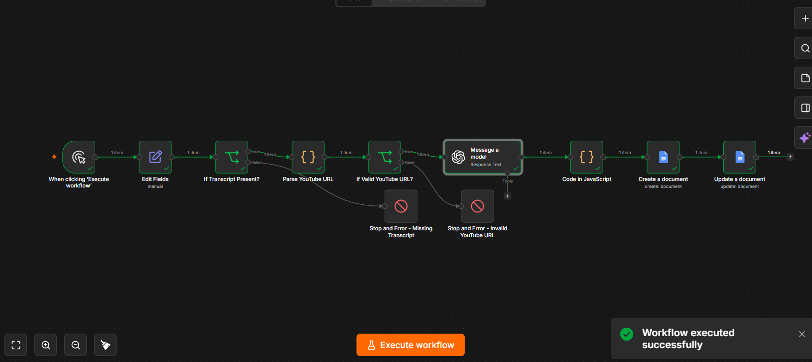

# Podcast to AI-Optimized Blog Automation

An AI automation workflow built with n8n that transforms podcast transcripts into structured, publication-ready blog content using the OpenAI API and automatically creates a Google Doc containing the finished content package.

## Workflow



The screenshot above shows a successful end-to-end execution, including transcript validation, YouTube URL validation, OpenAI structured content generation, JavaScript transformation, and Google Docs output.

## Current Workflow

The workflow currently:

1. Accepts a podcast transcript as input.
2. Accepts a YouTube URL associated with the episode.
3. Accepts a list of relevant business resources or offers.
4. Validates that the transcript contains non-whitespace content before processing.
5. Parses and validates supported YouTube URL formats, including:
   - Standard YouTube watch URLs
   - `youtu.be` URLs
   - YouTube Shorts URLs
6. Extracts and stores the validated 11-character YouTube video ID.
7. Stops the workflow with a clear error if the transcript is missing or the YouTube URL is invalid.
8. Sends the transcript and resource context to an OpenAI model.
9. Uses a strict JSON schema to return:
   - Blog title
   - Meta title
   - Meta description
   - Blog HTML
   - FAQ schema
10. Validates the structured OpenAI response before downstream processing.
11. Uses JavaScript in an n8n Code node to:
    - Confirm all required structured fields are present and non-empty
    - Reuse the already-validated YouTube video ID
    - Generate deterministic YouTube embed HTML
    - Insert the embed into the finished article
12. Creates a new Google Doc using the generated blog title.
13. Populates the document with:
    - Blog title
    - Meta title
    - Meta description
    - Article HTML
    - FAQ schema
    - YouTube URL

## Workflow Flow

```text
Manual Trigger
→ Edit Fields
→ Transcript Validation
→ YouTube URL Parsing
→ YouTube Validation
→ OpenAI Structured Content Generation
→ OpenAI Response Validation + JavaScript Formatting
→ YouTube Embed Generation
→ Google Docs Creation
→ Google Docs Update
```

## Tech Stack

- n8n
- OpenAI API
- Google Docs API
- Google Drive API
- JSON Schema
- JavaScript
- Docker
- Git / GitHub

## Design Decisions

The workflow separates generative AI tasks from deterministic automation logic.

OpenAI is used for tasks requiring language understanding and contextual judgment, including:

- Transforming an unstructured transcript into structured article content
- Generating search metadata
- Creating FAQ content and schema
- Determining whether provided resources are contextually relevant

n8n and JavaScript handle predictable workflow logic and transformations, including:

- Validating required input
- Rejecting blank or whitespace-only transcripts
- Parsing supported YouTube URL formats
- Extracting and storing the validated YouTube video ID
- Reusing the validated video ID downstream rather than parsing the URL multiple times
- Validating the structured OpenAI response before document creation
- Generating embed HTML
- Creating the Google Doc
- Passing structured output between workflow steps
- Stopping execution when required input or output is invalid

This reduces unnecessary reliance on the LLM, avoids duplicate parsing logic, and makes the automation more predictable and easier to troubleshoot.

## Prompt and Voice Design

The OpenAI prompt is designed to constrain both the content and the writing style of the generated article.

Content instructions require the model to:

- Use only information supported by the podcast transcript
- Avoid inventing facts, statistics, quotes, claims, URLs, products, or resources
- Use only the business resources explicitly provided to the workflow
- Return a predictable structured content package using a strict JSON schema

The prompt also includes writing-style guidance intended to preserve the speaker's natural voice rather than defaulting to generic AI-generated business prose.

Current style requirements include:

- Preserve the speaker's natural voice, point of view, and level of directness
- Keep the writing conversational
- Use natural contractions where appropriate
- Avoid em dashes
- Avoid generic AI-style transitions and overly polished corporate language
- Avoid making the source material more formal than necessary
- Improve organization and readability without flattening the speaker's personality

These requirements were added after realistic workflow testing showed that technically correct output could still lose some of the source speaker's voice.

A future enhancement could provide additional writing samples dynamically through retrieval or another voice-reference system. The current version intentionally uses prompt-based voice guidance to keep the workflow simple and reproducible.

## Input and Output Validation

The workflow performs validation both before and after the OpenAI API call.

Input validation includes:

- Transcript must contain non-whitespace content
- YouTube URL must match a supported YouTube format
- YouTube video ID must match the expected 11-character format

If input validation fails, the workflow stops with an explicit error rather than making an unnecessary OpenAI API call.

The structured OpenAI response is also validated before Google Docs processing begins.

The workflow confirms that the response contains non-empty string values for:

- `blog_title`
- `meta_title`
- `meta_description`
- `html`
- `faq_schema`

If the expected structured content is missing or incomplete, the workflow throws a clear error instead of creating an incomplete document.

## Google Docs Output

The workflow automatically creates a Google Doc for each successful run.

The document includes:

- Blog title
- Meta title
- Meta description
- Article HTML
- FAQ schema
- Original YouTube URL

The article is currently stored as literal HTML source inside the Google Doc. This is intentional for the current version because the output is designed to be reviewed before being copied into a publishing platform or CMS.

## Security

- API keys and OAuth secrets are stored outside the repository.
- The current public workflow export omits n8n credential references and instance-specific metadata.
- Environment-specific values, such as the Google Drive folder ID, are replaced with placeholders before publication.
- Workflow exports are reviewed and validated before being committed.
- Public repository files contain no API keys or OAuth secrets.

## Version 1 Status

Working:

- Manual transcript input
- YouTube URL input
- Relevant-resource input
- Transcript input validation
- Whitespace-only transcript rejection
- YouTube URL parsing
- YouTube watch URL support
- `youtu.be` URL support
- YouTube Shorts URL support
- YouTube video ID validation
- Explicit Stop & Error handling for invalid input
- OpenAI API integration
- Structured JSON Schema output
- Structured OpenAI response validation
- Required-field validation before downstream processing
- HTML article generation
- SEO metadata generation
- FAQ schema generation
- Contextual selection and insertion of relevant business resources
- Deterministic YouTube embed generation
- Reuse of validated YouTube video ID downstream
- Google Docs document creation
- Automated content insertion into Google Docs
- Persistent local n8n environment using Docker
- Sanitized GitHub workflow export

## Repository Files

- `workflow-v1.json` - sanitized exported n8n workflow
- `README.md` - project documentation
- `.gitignore` - excludes local credentials, environment files, n8n data, and other local-only files
- `sample-output.md` - sanitized example of the generated content package
- `docs/workflow-success.png` - screenshot of a successful end-to-end workflow execution

## Setup and Import

### Prerequisites

To run this workflow locally, you will need:

- Docker
- n8n
- An OpenAI API account and API key
- A Google Cloud project
- Google Drive API enabled
- Google Docs API enabled
- Google OAuth credentials configured for n8n

### 1. Start n8n

This project was developed using n8n running locally in Docker with a persistent volume:

```bash
docker run -it --rm --name n8n -p 5678:5678 -v n8n_data:/home/node/.n8n docker.n8n.io/n8nio/n8n
```

Then open:

```text
http://localhost:5678
```

### 2. Import the Workflow

1. Download or clone this repository.
2. Open n8n.
3. Import `workflow-v1.json`.
4. Because the public workflow export is sanitized, credential references will need to be configured after import.

### 3. Configure OpenAI

Create or connect an OpenAI API credential in n8n and assign it to the OpenAI node.

The workflow uses structured output with a strict JSON schema to generate:

- Blog title
- Meta title
- Meta description
- Article HTML
- FAQ schema

### 4. Configure Google OAuth

Create a Google Cloud project and enable:

- Google Drive API
- Google Docs API

Create an OAuth web application and use the n8n OAuth callback URL:

```text
http://localhost:5678/rest/oauth2-credential/callback
```

Connect the resulting Google credential to both Google Docs nodes in the workflow.

### 5. Configure the Google Drive Folder

The public workflow contains the placeholder:

```text
YOUR_GOOGLE_DRIVE_FOLDER_ID
```

Replace this with the ID of the Google Drive folder where generated documents should be created.

### 6. Add Test Inputs

The `Edit Fields` node accepts:

- `transcript`
- `youtube_url`
- `relevant_links`

The transcript should contain actual non-whitespace content.

Supported YouTube URL formats include:

- Standard watch URLs
- `youtu.be` URLs
- YouTube Shorts URLs

### 7. Run the Workflow

Click **Execute workflow** in n8n.

A successful run will:

1. Validate the transcript.
2. Parse and validate the YouTube URL.
3. Send the transcript and resource context to OpenAI.
4. Validate the structured AI response.
5. Generate the YouTube embed using deterministic JavaScript.
6. Create a Google Doc.
7. Insert the complete generated content package into the document.

The Google Doc contains literal HTML source for review before publication.

## Project Goal

This project converts an existing manual AI-assisted podcast-to-blog process into a repeatable automation.

The project is designed to demonstrate practical AI implementation skills, including:

- Workflow design
- API integration
- Structured LLM output
- JSON Schema configuration
- JavaScript transformations
- Input validation
- Output validation
- Error handling
- OAuth integration
- Google Docs automation
- Docker-based local workflow execution
- Testing and troubleshooting
- Secure credential handling
- Git and GitHub version control
- AI-assisted development and code review

The goal is not to automate every part of publishing. The current version focuses on producing a reliable, structured content package that can be reviewed before publication.